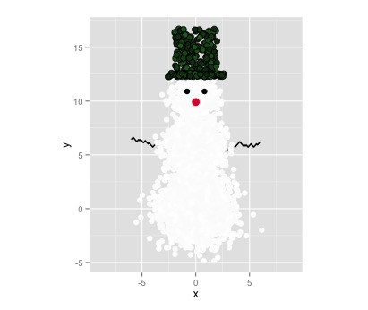
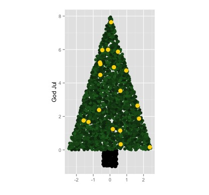
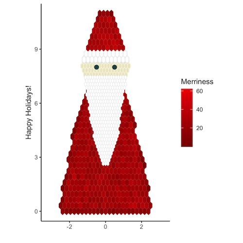
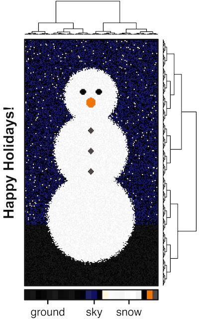

# chRistmas

R scripts for making Christmas cards/ gift tags with R.

## ggplot

### [snowman.R](snowman.R) (2015)

### [christmastree.R](christmastree.R) (2015)

### [hexbin_santa.R](hexbin_santa.R) (2018)

## [BPG](https://CRAN.R-project.org/package=BoutrosLab.plotting.general)

### [bpg_tree.R](bpg_tree.R) (2016)

### [snowman_heatmap.R](snowman_heatmap.R) (2017)

