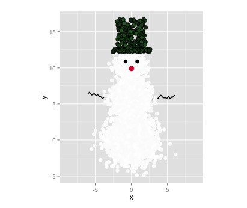
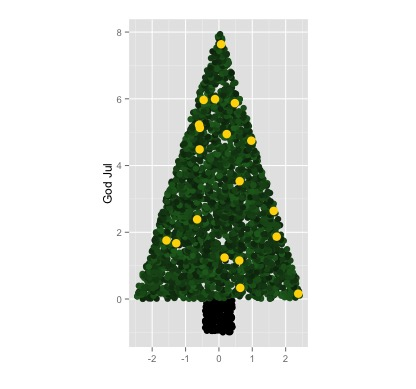
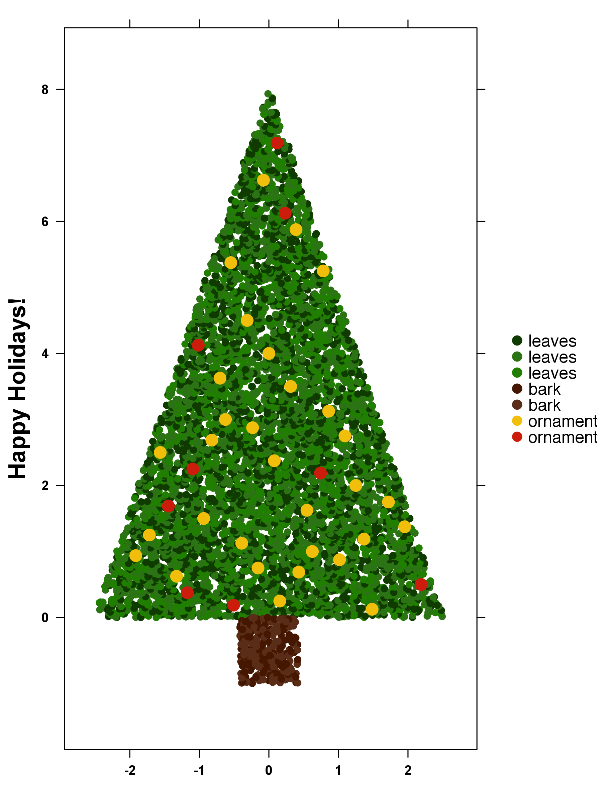
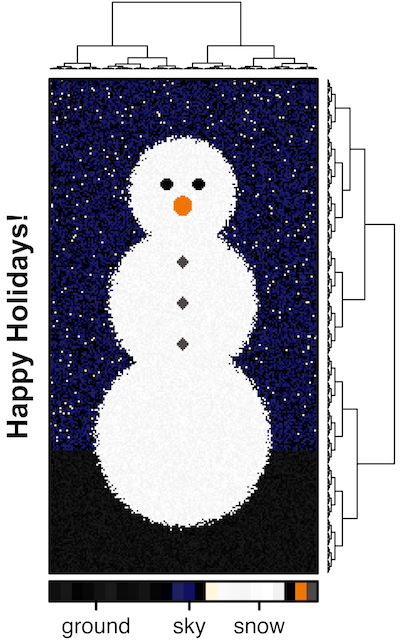
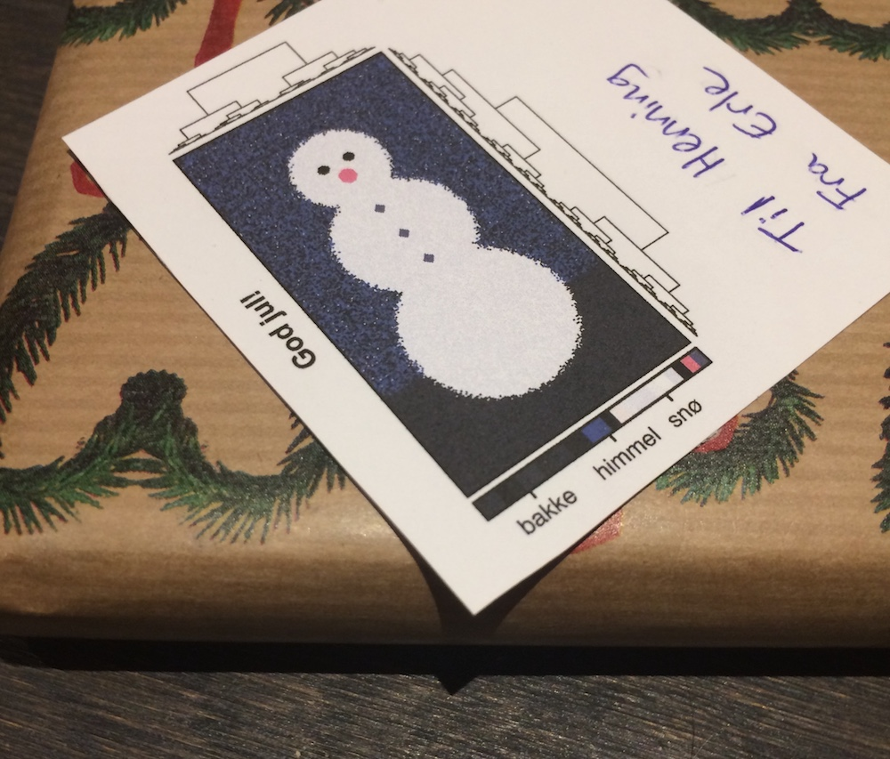

# chRistmas

R scripts for making Christmas cards/ gift tags with R.

## ggplot

### [snowman.R](snowman.R)

### [christmastree.R](christmastree.R)

## [BPG](https://CRAN.R-project.org/package=BoutrosLab.plotting.general)

### [bpg_tree.R](bpg_tree.R)

### [snowman_heatmap.R](snowman_heatmap.R)

